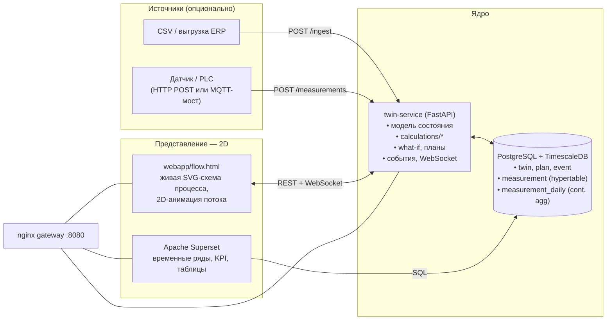

# TwinLab — архитектура (lean)

## Идея

Цифровой двойник **бизнес-процесса** — это не device shadow и не 3D-сцена.
Это: модель состояния процесса + история во временных рядах + расчёты
(прогноз, план, what-if) + правила/алерты + 2D-представление.

Поэтому весь IoT-стек (Eclipse Ditto, Hono, Kafka, MQTT, Telegraf, InfluxDB,
Grafana, MongoDB) убран. Осталось четыре контейнера.

## Компоненты

| Контейнер | Образ | Роль |
|---|---|---|
| `postgres` | `timescale/timescaledb:2.17.2-pg16` | единое хранилище: домен-модель двойника + временные ряды + continuous aggregate для KPI. Отдельная БД `superset` для метаданных Superset. |
| `twin-service` | `./twin-service` (Python 3.12) | REST + WebSocket API, модель состояния, расчёты, планы, what-if, события. Заменяет Ditto + Hono + Kafka + MQTT-publisher. |
| `superset` | `apache/superset:5.0.0` (+psycopg2) | единственный BI-инструмент, читает `twin` напрямую. Без headless-браузера. |
| `gateway` | `nginx:1.27-alpine` | единая точка входа `:8080`, отдаёт `webapp/` и проксирует `/api/`, `/analytics/`, `/jupyter/`. |

Опционально:
- `--profile reports` → `redis` + `celery-worker` + `celery-beat` + `mailhog` для Superset Alerts & Reports;
- `--profile notebooks` → `jupyter` (scipy-notebook + доступ к БД).

## Модель данных

| Таблица | Назначение |
|---|---|
| `twin` | один процесс: `config` (рецептура, параметры, маппинг импорта), `state` (текущее состояние, jsonb), `flow` (шаблон схемы: узлы с x/y, рёбра) |
| `twin_state_history` | append-only снимки состояния (hypertable) |
| `measurement` | временные ряды: `metric`, `value`, `ts` (hypertable). Движение товара хранится как метрики `inflow`/`outflow`/`stock` |
| `measurement_daily` | continuous aggregate: сутки × метрика → avg/min/max/last. Источник для Superset |
| `plan` | версии плана (what-if и активный), `params` + `result` |
| `event` | журнал событий процесса |

## API twin-service

| Метод | Путь | Что делает |
|---|---|---|
| `GET` | `/api/twins` | список двойников |
| `POST` | `/api/twins` | создать двойника |
| `GET` | `/api/twins/{id}` | двойник целиком |
| `PATCH` | `/api/twins/{id}/state` | merge-патч состояния + запись в историю |
| `POST` | `/api/twins/{id}/ingest` | загрузить CSV движения (файл или `text/csv`) |
| `POST` | `/api/twins/{id}/measurements` | добавить точки временных рядов |
| `GET` | `/api/twins/{id}/history` | выборка временных рядов |
| `POST` | `/api/twins/{id}/plan` | what-if: пересчитать план (не сохраняется) |
| `POST` | `/api/twins/{id}/plan?activate=true` | пересчитать и сделать активным (пишет `plan`, двигает `state`) |
| `GET` | `/api/twins/{id}/plan` | активный план + история планов |
| `GET` | `/api/twins/{id}/events` | журнал событий процесса |
| `GET` | `/api/twins/{id}/flow` | схема процесса со статусами узлов и потоками |
| `WS` | `/api/twins/{id}/ws` | пуш обновлений схемы/состояния/плана |

## Как добавить новый процесс

1. `POST /api/twins` с `config`, `state`, `flow` (шаблон схемы).
2. Написать расчёт в `twin-service/app/calculations/<name>.py` — чистые функции.
3. Подключить его в обработчике `/plan` (диспетч по `twin.kind`).
4. Задать правила подсветки узлов в `flow.py` (`rule: ...`).
5. Построить дашборд в Superset поверх `twin`.

## Расширение до реальной телеметрии

Не нужно поднимать Ditto/Hono/Kafka. Варианты:
- устройства шлют `POST /api/twins/{id}/measurements`;
- лёгкий Mosquitto (1 контейнер) + подписчик в `twin-service`;
- Telegraf → PostgreSQL, если привычнее.
