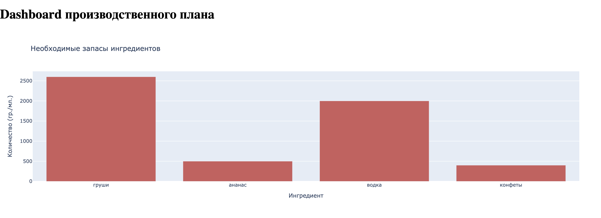
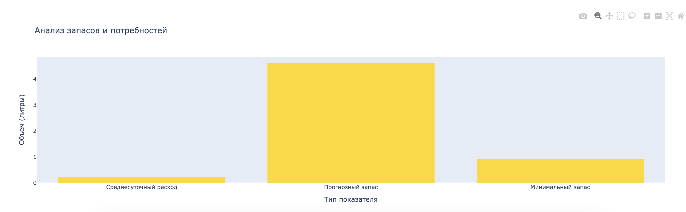

# Drinks Product Manufacturing Planning

The program automates the process of food manufacturing planning considering current stock levels and raw material requirements. It includes preprocessing input data, calculating forecasted values, sending this data to the enterprise's digital copy (Digital Twin), and building an interactive dashboard to visualize critical production metrics.

## General Workflow:
- Input data loading and preprocessing.
- Calculating required quantities of ingredients and projected stock levels.
- Transmitting these calculations to the company’s Digital Twin.
- Building an interactive dashboard with essential production metrics.

## Key Classes:

## 1. TableManager
Responsible for preprocessing data about product movements. Reads data from a CSV file, cleans and saves processed results into another file.

- **preprocess_and_save(input_table_path, output_table_path)** — reads input table, processes data, and saves result to specified path.

## 2.ProductionCalculator
Performs calculations of predicted production volumes and required raw materials based on prepared data.

Methods:
- **load_and_prepare_data()** — loads and prepares the processed dataset.
- **calculate_average_daily_consumption()** — calculates average daily consumption rate.
- **calculate_forecasted_stock(forecast_days, weekend_factor)** — forecasts future stock levels over a given number of days.
- **calculate_safety_stock(forecast_days, safety_factor, weekend_factor)** — determines minimal safe stock level.
- **calculate_required_production(forecast_days, safety_factor, weekend_factor)** — computes required production volume based on forecasted demand and stock levels.
- **calculate_ingredient_requirements(required_production_value)** — estimates needed amounts of each ingredient for planned production volume.

## 3.DigitalTwinPublisher
Sends calculated data to the Enterprise’s Digital Twin, ensuring monitoring of production and storage conditions.

Methods:

- **send_data_to_ditto(args)** — sends calculated data regarding product demands and stocks to the Digital Twin.
- **disconnect()** — closes connection with the Digital Twin system.

## 4. VisualizationDashboard
Provides visual representation of key production metrics through an interactive dashboard powered by Dash.

Methods:
- **create_dataframes()** — creates DataFrames storing ingredient requirement and stock prediction data.
- **build_graphs()** — builds graphs displaying consumption rates and stock predictions.
- **create_dashboard()** — forms the structure of the dashboard with ready-made charts.
- **run_app()** — starts the server hosting the interactive application.

- - - - 
# Планирование производства напитков

Программа предназначена для автоматизации процесса планирования производства продуктов питания с учётом текущего состояния запасов и потребностей в сырье. Включает обработку данных, расчёт прогнозируемых значений, отправку данных в цифровую копию предприятия ("цифровой двойник") и построение интерактивного дашборда для визуализации ключевых показателей.

## Общая логика работы программы:
- Производится загрузка и подготовка данных о движении товаров.
- Выполняются расчёты необходимых количеств ингредиентов и запасов на определенный период.
- Рассчитанная информация передается в цифровую копию предприятия.
- Формируется интерактивный дашборд с ключевыми производственными показателями.

## 1. TableManager
Класс предназначен для предварительной обработки данных о движении продуктов. Читает данные из файла формата CSV, производит очистку и сохранение данных в заданный выходной файл.

- **preprocess_and_save(input_table_path, output_table_path)** — читает исходный файл, обрабатывает данные и сохраняет обработанный результат в выходном файле.
## 2. ProductionCalculator
Производит расчёты прогнозируемых объёмов производства и необходимого сырья на основе подготовленных данных.

Методы:

- **load_and_prepare_data()** — загружает подготовленную таблицу и проводит начальные операции над данными.
- **calculate_average_daily_consumption()** — вычисляет среднее потребление продукта в сутки.
- **calculate_forecasted_stock(forecast_days, weekend_factor)** — рассчитывает прогнозируемый запас на определённое количество дней.
- **calculate_safety_stock(forecast_days, safety_factor, weekend_factor)** — определяет минимальный безопасный уровень запасов.
- **calculate_required_production(forecast_days, safety_factor, weekend_factor)** — вычисляет необходимое производство исходя из прогноза спроса и уровня запасов.
- **calculate_ingredient_requirements(required_production_value)** — подсчитывает нужное количество каждого ингредиента для запланированного объёма производства.

## 3. DigitalTwinPublisher
Класс служит для отправки рассчитанной информации в цифровую копию предприятия (Цифровой Двойник), обеспечивая мониторинг состояния производства и складских запасов.

Методы:

send_data_to_ditto(*args) — отправляет данные о потребностях в продуктах и запасах в цифровую копию.
disconnect() — закрывает соединение с системой.
## 4. VisualizationDashboard
Позволяет визуализировать ключевые производственные метрики с помощью интерактивного дашборда, построенного на библиотеке Dash.

Методы:

- create_dataframes() — создаёт DataFrame для хранения данных о потребностях в ингредиентах и прогнозах запасов.
- build_graphs() — строит графики с показателями расходов и запасов.
- create_dashboard() — формирует структуру дашборда с готовыми графиками.
- run_app() — запускает сервер с интерактивным приложением. 
